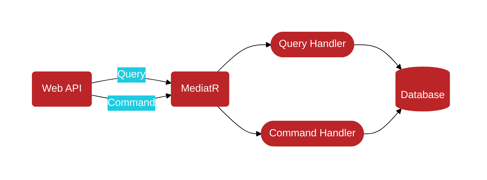

# A demo of Mediator pattern
>In software engineering, the mediator pattern defines an object that encapsulates how a set of objects interact. This pattern is considered to be a behavioral pattern due to the way it can alter the program's running behavior... 
>
>...with the mediator pattern, communication between objects is encapsulated within a mediator object. Objects no longer communicate directly with each other, but instead communicate through the mediator. This reduces the dependencies between communicating objects, thereby reducing coupling. - Wiki
---
## What is Aspect Oriented Programming?
>In computing, aspect-oriented programming (AOP) is a programming paradigm that aims to increase modularity by allowing the separation of cross-cutting concerns, such as validation, logging, exception handling, security, caching, retry, etc. 
>
>Basically the idea is to isolate the supporting functions from the main program’s business logic.

---
## Pros and Cons

* **Single Responsibility Principle**: You can extract the communications between various 
components into a single place, making it easier to comprehend and maintain.
* **Open/Closed Principle**: You can introduce new mediators without having to change the actual components.
* You can reduce coupling between various components of a program.
---
## MediatR Nuget Package
> Simple mediator implementation in .NET

> In-process messaging with no dependencies.

> Supports request/response, commands, queries, notifications and events, synchronous and async with intelligent dispatching via C# generic variance.
---

---

## Here we have three demos to show gradual changes/improvement and the use of the "MediatR" library.
- MediatorPatternDemo
- MediatorPatternDemo.V2
- MediatorPatternDemo.V3
- MediatorPatternDemo.Web (which uses the [MediatR nuget package](https://github.com/jbogard/MediatR))

